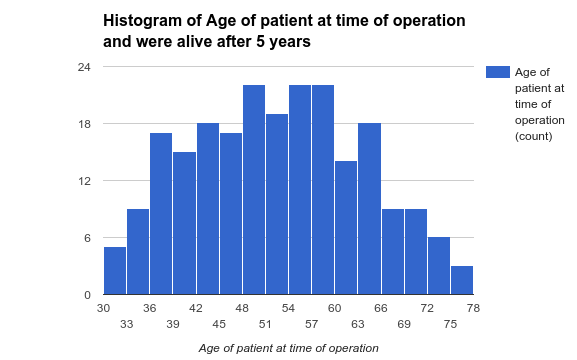
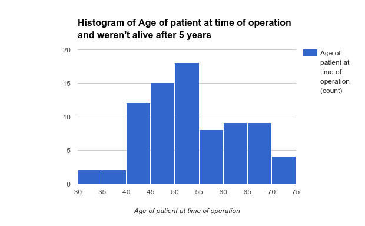

# #Project 1: Test a Perceptual Phenomenon
##Background information
Abstract: Dataset contains cases from study conducted on the survival of patients who had undergone surgery for breast cancer

Dataset Information: The dataset contains cases from a study that was conducted between 1958 and 1970 at the University of Chicago's Billings Hospital on the survival of patients who had undergone surgery for breast cancer.

Attribute Information:

1. Age of patient at time of operation (numerical) 
2. Patient's year of operation (year - 1900, numerical) 
3. Number of positive axillary nodes detected (numerical) 
4. Survival status (class attribute) 
	* 1 = the patient survived 5 years or longer 
	* 2 = the patient died within 5 year

**Dataset:** [View data](Book2.xlsx)

##Preprocessing the Dataset

Before using the dataset, we need to preprocess it it separate every value in respective columns for proper functioning of the data. I wrote a python program to preprocess it but we can use any language to preprocess it. I used openpyxl library to extract the values from excel and do appropriate processing and get the desired csv file.

**Python Code** [View code](preprocess.py)
**Preprocessed Dataset** [View data](prep.csv)

##Questions for investigation

####1. What is our independent variable? What is our dependent variable?
**Dependent variable:** survival of the patients

**Independent variable:** surgery for breast cancer

####2. What is an appropriate set of hypotheses for this task? What kind of statistical test do you expect to perform?

**Hypothesis test**

**H<sub>0</sub>:** Age of the patient who were alive after 5 years of operation is same as the age of the patient who were not alive after 5 years.

**H<sub>A</sub>:** Age of the patient who were alive after 5 years of operation is not same as the age of the patient who were not alive after 5 years


The data is roughly normally distributed for both the cases i.e. histogram for the age of the patient who survived after 5 years and histogram for the age of the patient who did not survive after 5 years. We will do a F test(ANOVA test) because we are comparing two samples of the same dataset which are normal and have different dataset sizes. If the data set is same then we can also do two tailed dependent t test.

####3. Report some descriptive statistics regarding this dataset.

**For the patient of Case 1: (were alive after 5 years of operation)**

Mean of ages: 52.0178

SD of ages: 10.987

**For the patient of Case 2: (were dead after 5 years of operation)**

Mean of ages: 53.6790

SD of ages: 10.1041

####4. Provide one or two visualizations that show the distribution of the sample data. Write one or two sentences noting what you observe about the plot or plots.

**Statistical test**

 



The above graphs are the visualizations that show the distribution of the sample data. For the graph 1 i.e. the histogram for the ages of people who were alive after 5 years of operation, shows that most of the people who were alive were between 48-60 age. The distribution is a normal distribution.
For graph 2 i.e. the histogram for the ages of people who were found dead after 5 years of operation, shows that most of the people who were dead were between 50-55 age. The distribution is a normal distribution.


####5. What is your confidence level and your critical statistic value? Do you reject the null hypothesis or fail to reject it? Come to a conclusion in terms of the experiment task. Did the results match up with your expectations?

```
Xk1 = 52.0178
Xk2 = 53.6790
Xg = 52.4575
K = 2
N = 306
SSbetween = 164.3644
SSwithin = 35433.5832
Dfbetween = 2-1 = 1
Dfwithin = 306 - 2 = 304
MSbetween = 164.3644
MSwithin = 116.5578
F-Ratio = 1.4101
F critical value at alpha 0.1 = 2.70
F critical value at alpha 0.05 = 3.84
P value = 0.2360
```

Hence it does not lie in critical regions and therefore it is not statistically significant.
Hence **we fail to reject the null or we retain the null.**
Hence the mean of case 1 is equal to mean of case 2.

####6. Optional: What do you think is responsible for the effects observed? Can you think of an alternative or similar task that would result in a similar effect?

The above study tells us that age of the patient is not the only factor which would help us predict that the patient will live more than five years or not. According to the research conducted, the life expectancy of the patient depends on the age of the patient, early detection, whether it has spread to other parts of the body, which grade is it at the time of operation, general health, types of tissue cancer has affected, attitude and outlook.


